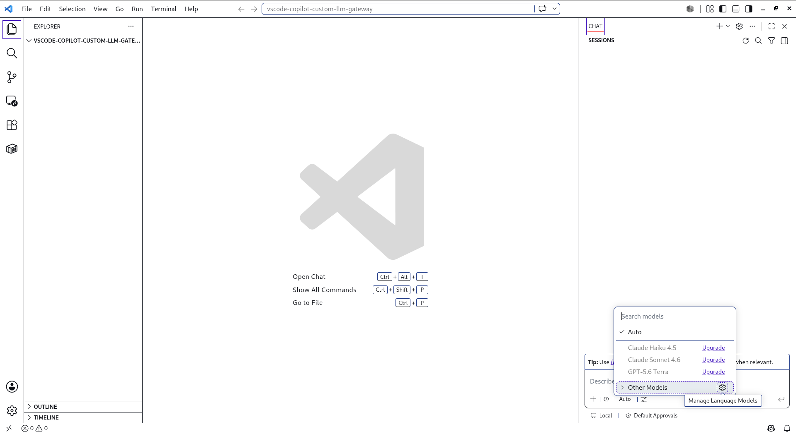
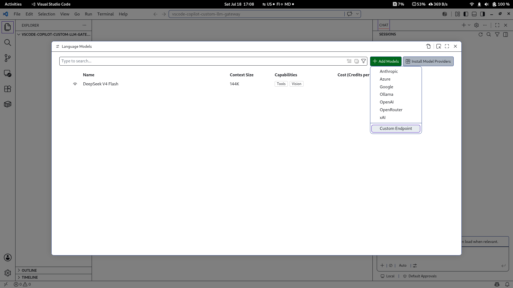
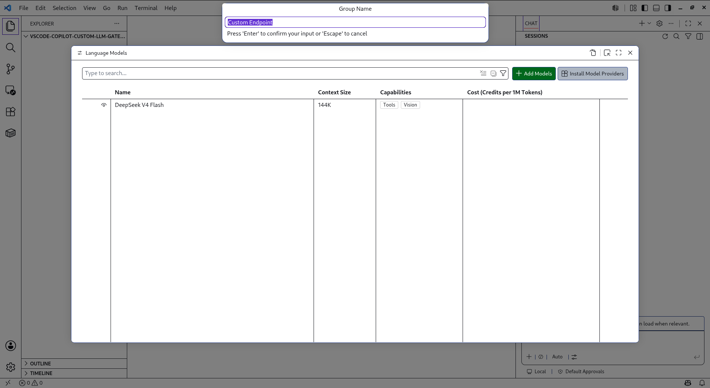
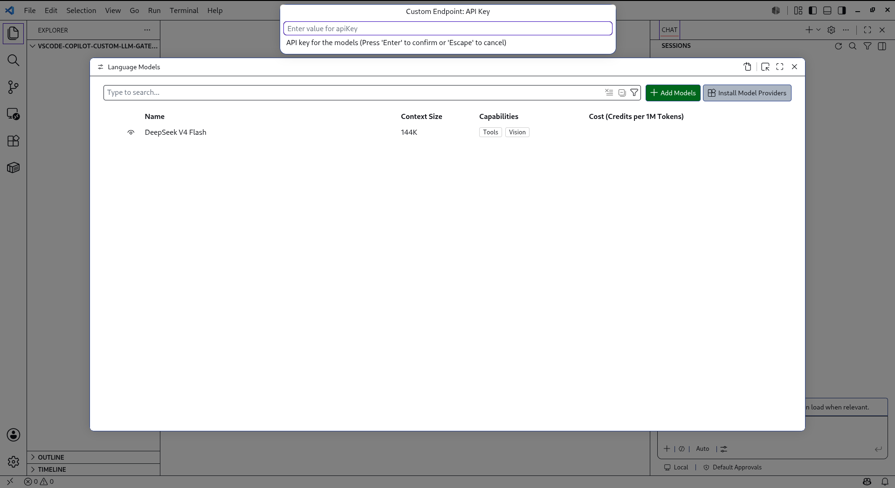
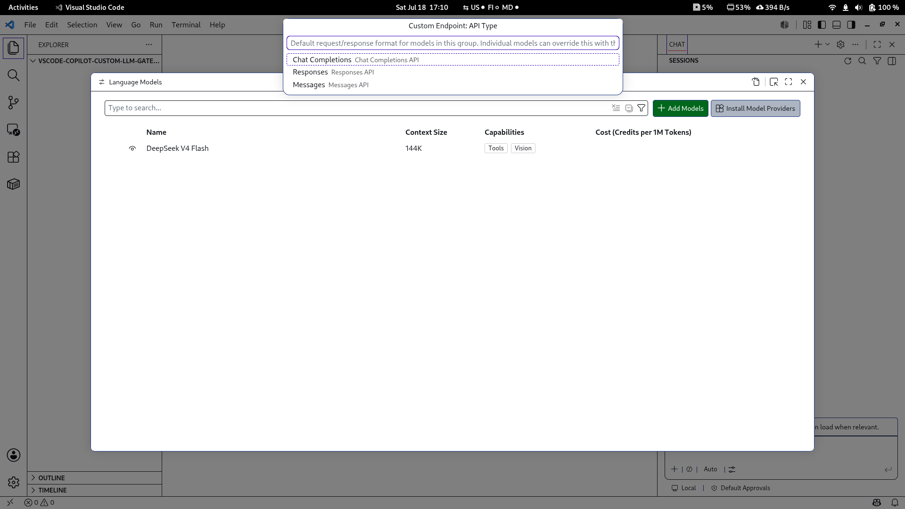
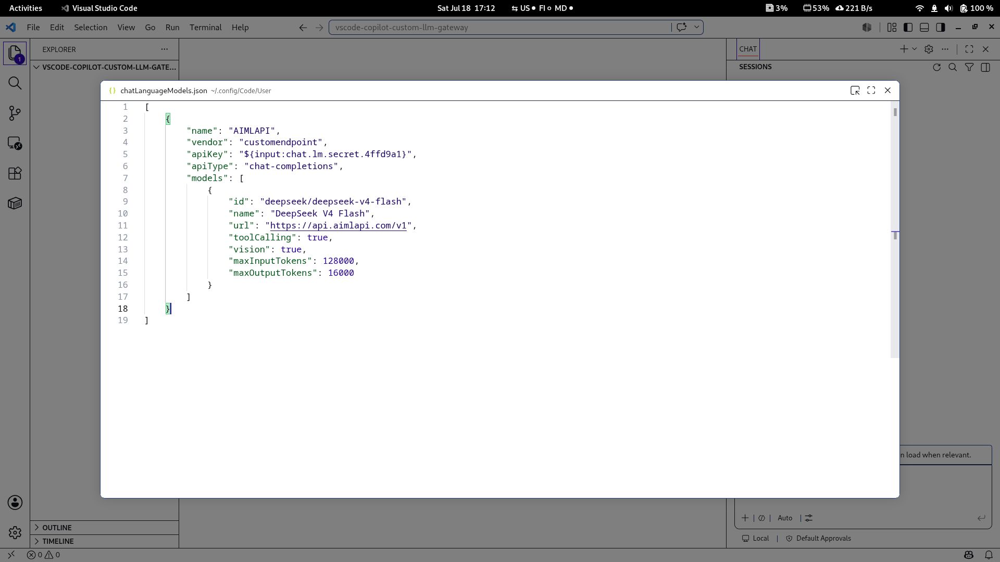
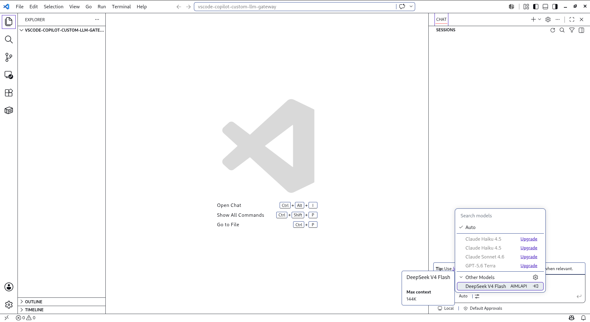

# How to Configure VS Code Copilot with AIMLAPI

Use [AIMLAPI](https://aimlapi.com/), a crypto-friendly LLM gateway, as a custom endpoint for GitHub Copilot Chat in VS Code.

## Setup

### 1. Open the model selector

Open GitHub Copilot Chat and click the model selector. It may display:

* `Auto`
* or the name of the currently selected model

Click the settings icon next to the model selector (**Manage Language Models**).

### 2. Add a model

Click **Add Models** and then select **Custom Endpoint**.

### 3. Confirm the custom endpoint

Leave **Custom Endpoint** selected and press **Enter**.

### 4. Enter the API key

Enter your API key and press **Enter**.

### 5. Select the API type

Select **Chat Completion** and press **Enter**.

### 6. Configure the model

Configure the JSON using the model information from aimlapi.com.

**Group:**

* **`name`**: `AIMLAPI` or your preferred group name

**Models:**

* **`id`**: The model ID from aimlapi.com, for example `anthropic/claude-fable-5`
* **`name`**: The display name for the model
* **`url`**: The base URL, for example `https://api.aimlapi.com/v1`

Save the configuration with `Ctrl+S`.

### 7. Select the model

Select the configured model in GitHub Copilot Chat.

